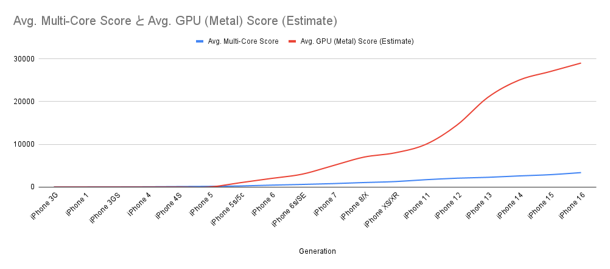

# DB history in Mobile

モバイルアプリ開発におけるDBの進化を振り返る

---

# モバイルアプリ開発の進化

- スマホ初期は、省スペック性が重視されていた
- スマホの進化に比例し、機能がリッチになった
- 開発生産性を維持するために、DBが進化した


<cite>generate by GeekBench data, Gemini</cite>

---
# 自己紹介

- Kuu 
    - ソフトウェアエンジニア@メルカリ
    - 普段はAndroidアプリ開発ばかり
    - バックエンドはほぼ触らない
- 趣味
    - スキー⛷️、旅行✈️
    - AI Agent, このスライドをホスティングするWeb AppもCursorで作成した


---

# 話していくこと

- モバイルアプリにおけるデータベース
- Relational Databaseに絞った内容にする
    - KVS, Document DB, Graph DB... は除外
- 近代のモバイルにおけるデータベースの現状を紹介

---

# サーバーで動かす時との違い
- 基本的にデータはローカルで処理しない
- データ量が多くなく、スケール必要ない
- /Googleの準備したものを使う事が多い


---

# モバイルアプリ初期の主流データベース

- iOS
    - Core Data
        - SQLiteのラッパー
- Android
    - SQLite
- mBaaS という名前で魑魅魍魎が存在したが、実質無視できるレベル

**性能的に組み込みに近く、理解できる。**


---

# モバイルアプリのトレンド

- モバイルアプリの機能性・美しさは上昇する一方
    - 開発コストを維持するために、進化が求められる
    - UI フレームワークが大胆に作り直された
- UIを提供する上で応答性は大事
    - 動作最適化のためにUIスレッドが存在する
    - UIスレッドを極力使わず、Worker threadで処理すべき
    - マルチスレッドを便利に使える環境が整いつつある


---

# モバイルアプリ近代の主流データベース

<div class="columns">
<div>

## iOS - SwiftData

- Swift UI との連携が意識されている
- Core Data のラッパーとしても振る舞える
- Concurrency を意識している
    - <cite>https://docs.swift.org/swift-book/documentation/the-swift-programming-language/concurrency</cite>


```swift
@Query var recipes: [Recipe]
var body: some View {
	List(recipes) { recipe in
		NavigationLink(recipe.name, destination: RecipeView(recipe))
	}
}
```

</div>
<div>

## Android - Room

- SQLiteの抽象レイヤ
- Kotlin Coroutinesを意識している
- SQL を使い操作もできる

```kotlin
@Dao
interface UserDao {
    @Query("SELECT * FROM user")
    fun getAll(): List<User>

    @Query("SELECT * FROM user WHERE first_name LIKE :first AND " +
           "last_name LIKE :last LIMIT 1")
    fun findByName(first: String, last: String): User
}
```

</div>
</div>

---

# まとめ

- モバイルアプリの中でも、RDBは動いている
- モバイルアプリを取り巻く環境は進化している
- データベースinモバイルアプリも同様に進化している

---

# ご清聴ありがとうございました！
